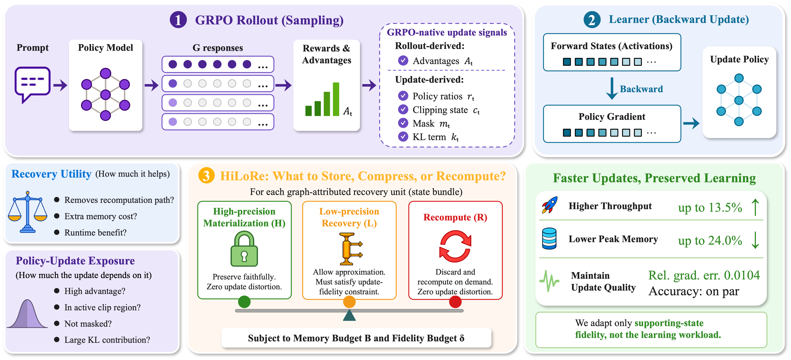

# HiLoRe: What to Store, Compress, or Recompute for Efficient GRPO Training

Code for the paper **"HiLoRe: What to Store, Compress, or Recompute for Efficient GRPO Training"**, focusing on **Qwen2.5-3B-Instruct / DeepMath10K** with gradient checkpointing (GC) and HiLoRe.

## 📖 Overview

HiLoRe reduces backward recomputation by choosing how to recover activation state under memory and update-risk budgets. It preserves the forward computation and GRPO workload, using three recovery actions:

- **H — Store:** retain the original-precision state.
- **L — Compress:** recover selected BF16 MLP state through direct FP8 E4M3FN conversion; retain other required state exactly.
- **R — Recompute:** replay the region from saved execution state.

Profiling measures recovery utility and memory cost. Calibration uses 16 training microbatches; allocation then refreshes after each microbatch forward using the current GRPO update signal.




## 🚀 Quick Start

### 1. Installation

Use Python 3.10, Linux and four CUDA GPUs. The paper uses four NVIDIA L40S 48-GB GPUs. Profiling requires NVML and dedicated devices.

```bash
python -m pip install -r requirements.txt
```

### 2. Prepare data

Provide local JSONL snapshots of DeepMath, MATH500 and the GSM8K test set:

```bash
python -m hilore.prepare_data --source /xxx/data/deepmath.jsonl \
  --math500 /xxx/data/math500.jsonl --gsm8k /xxx/data/gsm8k-test.jsonl \
  --output /xxx/data/prepared

SPLIT_MANIFEST=/xxx/data/prepared/manifest.json bash scripts/check_data.sh
```

This creates 10,000 training problems, 2,048 validation problems and a frozen manifest.

The default configuration expects 60 updates; GC and HiLoRe must use identical replays.

### 3. Initialize and run

Replace `/xxx/...` with your local paths. Use a genuine Qwen2.5-3B-Instruct snapshot. Initialization measures GC, profiles recovery, calibrates risk and validates candidate schedules on development replays drawn only from the training split.

```bash
export MODEL_PATH=/xxx/models/Qwen2.5-3B-Instruct
export SPLIT_MANIFEST=/xxx/data/prepared/manifest.json
export RISK_BUDGET=0.010

# Measure and build a development profile.
UPDATES_DIR=/xxx/development-replays OUTPUT_DIR=/xxx/initialization \
  bash scripts/initialize.sh

# Run matched actor replays.
export UPDATES_DIR=/xxx/replays
OUTPUT_DIR=/xxx/runs/gc bash scripts/run_actor.sh gc

DEVELOPMENT_PROFILE=1 PROFILE_PATH=/xxx/initialization/profile.json \
  OUTPUT_DIR=/xxx/runs/hilore bash scripts/run_actor.sh hilore
```

`0.010` is an example trial risk budget, not a selected operating point or the measured gradient-error threshold of `0.015`. Initialization does not certify terminal task quality; running a development profile requires the explicit flag above. Rejected profiles cannot be used.

The main settings are in [configs/qwen25_3b_deepmath.json](configs/qwen25_3b_deepmath.json): LoRA rank 16, alpha 32, zero dropout, eight responses per prompt, prompt/response limits 1024/2048, GRPO clip 0.2 and K3 KL coefficient 0.001. `PYTHON_BIN` selects Python; `DRY_RUN=1` previews a launch command. Use a new output directory for each run.
